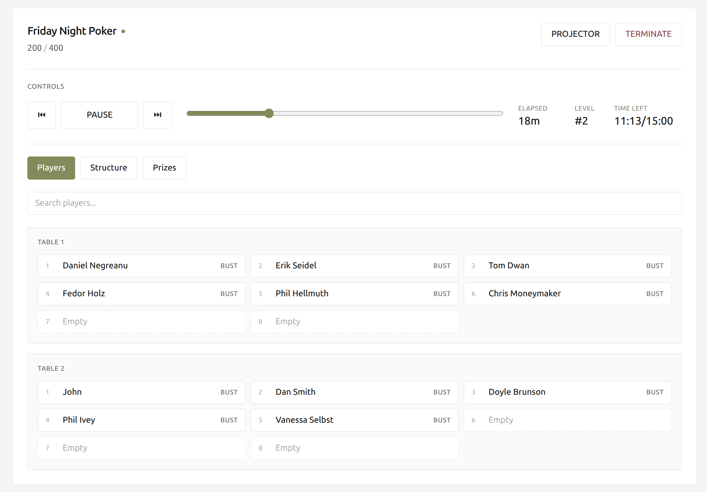
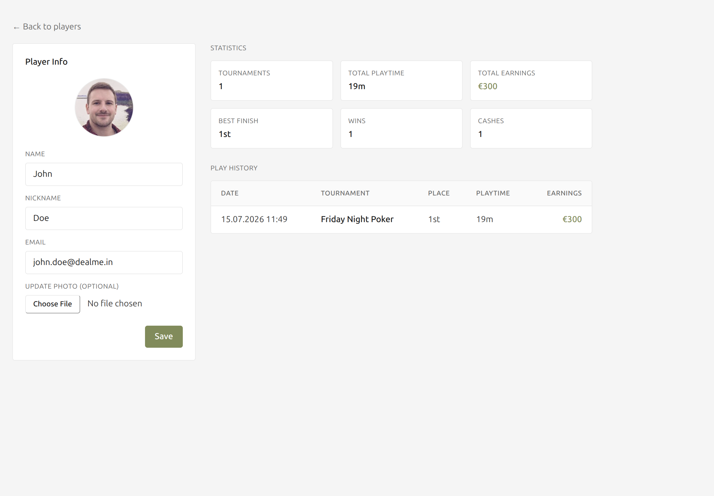

# Deal me in

A desktop application for running live poker tournaments — blind-level timer, table seating with automatic balancing and merging, player management, prize pools, and a full-screen projector display for the room.

Built with Electron, React and TypeScript.

> **Looking for how to actually run a tournament?** See the [User Guide](./USER_GUIDE.md).

## Features

- **Blind-structure timer** — counts down each level, advances automatically, and supports break levels.
- **Reusable structures** — build blind schedules (small/big blind, ante, duration, breaks) in a drag-to-reorder editor and reuse them across tournaments.
- **Player roster** — manage players with nickname, email and photo, stored locally.
- **Live seating** — randomize seating, drag players onto seats, and bust / un-bust players.
- **Auto-balance & auto-merge** — keeps tables even and collapses tables as players bust out, showing exactly which players moved and why.
- **Entry fees & prize pools** — set an entry fee and configure payouts per finishing place; net earnings (`prize − entry fee`) are tracked per player.
- **Projector view** — a full-screen display (wall clock, elapsed time, next break, current/next blinds, players remaining, average stack, prize distribution) for a second monitor.
- **Finalize & results** — ending a tournament opens a standings dialog (operator orders any still-seated players) that records each player's finishing place, time played, and earnings.
- **Tournament history** — a dedicated section listing past tournaments; open one to see full rankings with playtime and earnings.
- **Player profiles** — click a player to edit their info and see aggregate stats (tournaments, total playtime, total earnings, best finish, wins, cashes) plus a detailed play history.
- **Multiple tournaments** — run several tournaments and switch between them.
- **Localization & theming** — English / French, several accent colors, and EUR / USD / GBP / CHF currency formatting.

## Screenshots

| Tournament management | Player editing |
| --- | --- |
|  |  |

## Technology

| Concern | Choice |
| --- | --- |
| Desktop shell | [Electron](https://www.electronjs.org/) |
| UI | [React 18](https://react.dev/) + [React Router](https://reactrouter.com/) (HashRouter) |
| Language | [TypeScript](https://www.typescriptlang.org/) |
| Build / dev server | [Vite](https://vitejs.dev/) + `vite-plugin-electron` |
| Persistence | [SQLite](https://www.sqlite.org/) via [`better-sqlite3`](https://github.com/WiseLibs/better-sqlite3) |
| Styling | [Tailwind CSS](https://tailwindcss.com/) |
| Packaging | [electron-builder](https://www.electron.build/) (DMG / NSIS / AppImage) |

## Architecture

The app is split across Electron's two processes:

- **Main process** (`electron/`) owns all stateful logic — the SQLite database, the live tournament state, and window creation.
- **Renderer process** (`src/`) is a thin React view. It never holds the source of truth for a tournament; it mutates state through IPC and re-renders from `timer-update` broadcasts.

The two sides talk **only** through the IPC bridge in [`electron/preload.ts`](./electron/preload.ts), which exposes `window.api` (domain methods) and `window.ipcRenderer` (raw event subscription).

```
electron/
  main.ts        IPC handlers, window creation, app lifecycle
  tournament.ts  TournamentManager singleton — the live tournament state
  db.ts          better-sqlite3 setup, queries, default seed data
  preload.ts     contextBridge: window.api + window.ipcRenderer
src/
  App.tsx        routing + sidebar shell
  components/    React UI (control panel, projector, editors, modals)
  i18n/          translations, settings context, theming
  utils/         formatting helpers
```

The live tournament is a **main-process singleton** (`tournamentManager`). State is persisted to SQLite after every mutation and is restored (always paused) on startup. See [`CLAUDE.md`](./CLAUDE.md) for a detailed contributor's map of the IPC channels, persistence model, and the seating/balancing algorithms.

### Data storage

Everything lives in the OS user-data directory (e.g. `~/Library/Application Support/Deal me in/` on macOS):

- `poker_manager.db` — players, structures, tournaments, per-player **tournament results**, and app settings (SQLite, WAL mode).
- `photos/` — copies of player photos referenced by absolute path from the database.

On first run the database is seeded with a few sample players and two sample structures.

Deleting a player is a **soft delete**: the row is kept (so historical results stay
linked) but its personal info is cleared and it's hidden from the roster. Such a
player shows as `???` in past results.

## Development

```bash
npm install        # first time — rebuilds the better-sqlite3 native module for Electron
npm run dev        # Vite dev server + Electron with hot-module reload
```

`npm run dev` is the only command needed for local development.

## Quality checks

```bash
npm run lint       # ESLint over src/ and electron/ (zero-warning policy)
npx tsc --noEmit   # type-check without emitting
npm run test       # Vitest unit tests for the tournament engine (tests/)
```

## Building a release

```bash
npm run build      # tsc type-check → vite build → electron-builder packaging
```

Artifacts are written to `release/<version>/`. Targets are configured in
[`electron-builder.json5`](./electron-builder.json5): DMG (macOS), NSIS installer
(Windows x64), and AppImage (Linux).

## License

The source code in this repository is licensed under the [MIT License](LICENSE).

This license applies to the software only. The sound effects in `src/assets/sounds/`
are NOT covered by the MIT License. They are sourced from Pixabay and remain
subject to the Pixabay Content License. See [src/assets/sounds/CREDITS.md](src/assets/sounds/CREDITS.md)
for details and per-file attribution.